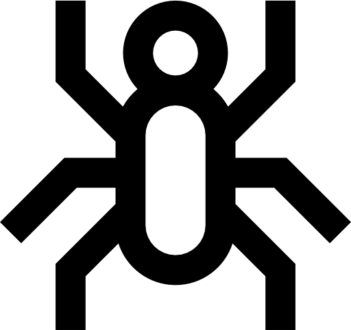
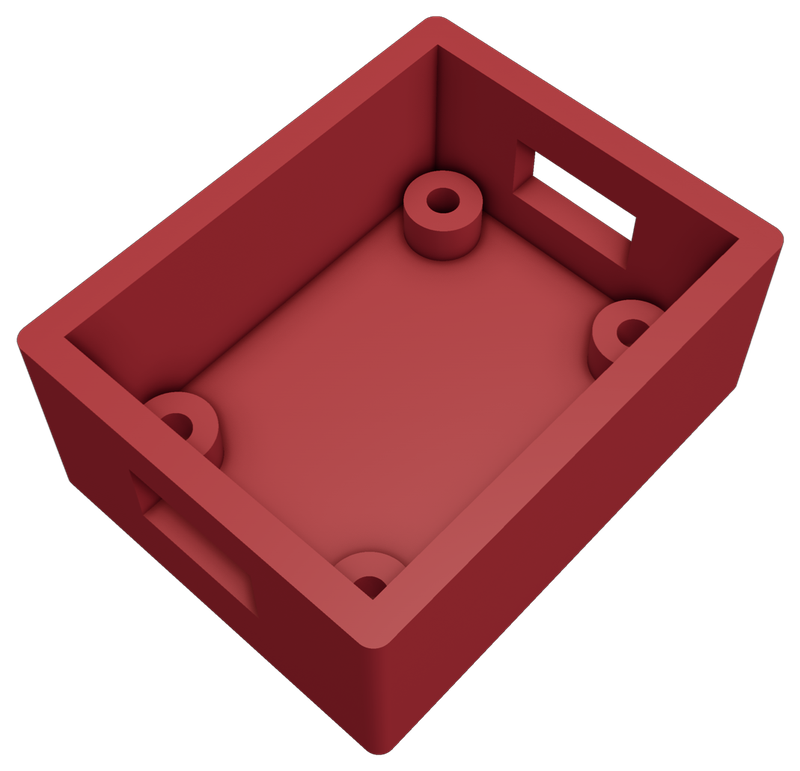
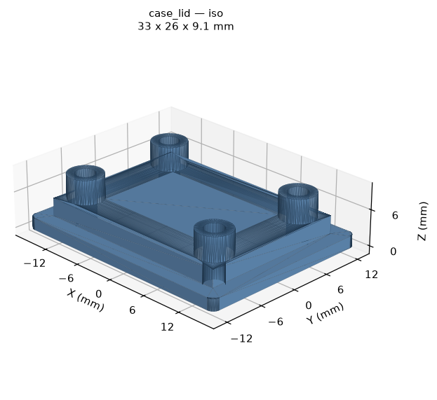

<div align="center">

<h1>
  <picture>
    <source media="(prefers-color-scheme: dark)" srcset="logo/spider-white.png">
    
  </picture>
  EVEE
</h1>

### Everyday Virtual Engineering Engine

#### *An AI assistant for hardware prototyping*

[](https://github.com/shivakumar-sridhar/EVEE/actions/workflows/tests.yml)
[](LICENSE)
[](pyproject.toml)
[](https://modelcontextprotocol.io)

> Natural language to a printed object, without opening CAD. Describe the part in a
> sentence, review the real geometry on screen, revise it in another sentence, approve the
> cost, and let it print — with a human decision at every step that moves the machine.
> Built to make hardware iterations faster.

**Parametric CAD · Verified Slicing · Printer Control · Human Approval Gates**

**Model Context Protocol (MCP) Server · Bring Your Own Model · Self-Hosted · No Cloud, No Account**

```bash
git clone git@github.com:shivakumar-sridhar/EVEE.git && cd EVEE && uv sync
```

</div>

---

## Why this exists

I am a solo founder building hardware, and iterative prototyping is slow.
Every sensor I work with needs something printed around it, and
each revision means opening CAD, sketching it, exporting it, slicing it, printing it,
discovering the connector cutout is two millimetres off, changing one number, and doing
the whole thing again.

A large part of my week goes into designing and printing parts for sensor stacks. The
geometry is rarely hard; the specification usually fits in one sentence — *a case for my
BNO085, ports on both ends, screw posts in the lid.* The friction is everything around
that sentence, and it is paid again on every iteration.

So I built an agent for the loop: design, review, revise, print. I say what I want, it
designs the part, I look at the real geometry on screen and say what is wrong, it changes
the number, and when I am happy it slices it and prints it. A revision costs me a
sentence instead of an afternoon — which means I iterate to the part I actually wanted
instead of settling for the first one that fit.

The spark was *Spider-Man: Brand New Day* — Peter talking to an assistant that just
fabricates his sensors and his suit while he keeps thinking about the problem. That is
the right shape for prototyping.

What follows is the whole workflow and every tool it is built from.

---

## The loop

One real request, start to finish:

**1. You describe it.** *"A case for my BNO085, ports on both ends, screw posts in the
lid."*

**2. The model picks a template and fills in the numbers.** It reads the template's JSON
schema, converts your sentence into parameters, and calls `design_part`. It never writes
geometry — only numbers, into a shape that was vetted in advance.

**3. The server builds it and shows you.** Two solids, exported as STLs, plus a 3D window
of the parts arranged on a virtual build plate exactly as they will print. You also get a
sentence stating what was actually built: *"Outer 33×26×14mm, 2mm walls, press-fit lid at
0.25mm clearance… usable interior 29×22×12mm."*

<div align="center">
<table>
<tr>
<td>

</td>
<td>

</td>
</tr>
</table>
</div>

*The two solids from that request — ports through both ends, posts in the lid to screw
down through. These are the exported STLs themselves, rendered with f3d; regenerate them
with `uv run python scripts/render_readme_assets.py`.*

> **Gate 1 — is the shape right?** You are looking at the real mesh, not a render of what
> the model intended. Wrong cutout position, lid too shallow, posts in the way: say so,
> and it rebuilds. This is where iteration actually happens.

**4. It slices.** The plate goes through PrusaSlicer with one hand-tuned profile, and you
get layer count, grams of filament, and print time.

> **Gate 2 — is the cost acceptable?** Forty minutes and four grams, or six hours and
> ninety? Now is when you find out, not after.

**5. It checks the printer** — state, temperatures, whether a bed mesh is stored.

> **Gate 3 — is the build plate clear?** You walk over and look. Nothing infers this and
> nothing can: no agent has eyes on your printer.

**6. It prints,** and your phone buzzes with a webcam snapshot when the part is done or
if something goes wrong.

---

## Technical overview

Every stage, and what it is built from.

| Stage | Hardware | Software |
|---|---|---|
| **Conversation** | microphone, optional | Claude Code, or any MCP client. Speech is the client's `/voice` — nothing in this repo listens |
| **Interface** | — | MCP server over stdio · `mcp` 2.0 · Pydantic 2.13 schemas and validation |
| **CAD** | — | build123d 0.11 on OpenCascade (B-rep solids, not meshes) · trimesh |
| **Review** | a screen | PrusaSlicer GUI for the plate · f3d fallback · matplotlib preview PNGs when headless |
| **Slicing** | — | PrusaSlicer 2.9.4 CLI, one hand-tuned `.ini`, run headless |
| **Printer link** | Raspberry Pi, USB serial @ 115200 | OctoPrint 1.11.8 REST API · httpx2 |
| **Machine** | Creality Ender-3 V3 SE · CR Touch probe · 220×220 bed | Marlin |
| **Notification** | webcam, phone | `evee.notify` as a systemd user service · ntfy.sh |
| **Development** | — | Python 3.13 · uv · pytest, 327 tests |

**The MCP server is the product. The model is bring-your-own.** Nothing here is
Claude-specific — `python -m evee.server` speaks the Model Context Protocol on its own,
and OpenCode, Cline or Zed drive it identically. The model contributes judgement about numbers; every rule about
what can be built and what can be printed lives server-side in Python, where it applies to
every client equally.

### The seven tools

| Tool | What it does |
|---|---|
| `list_templates()` | Every template and its JSON schema |
| `design_part(template, params)` | Builds the solids, exports STLs and a plate, opens the review window |
| `slice_part(stl_path)` | Slices with the verified profile; returns layers, grams, time |
| `get_printer_status()` | State, temperatures, current job, stored bed mesh |
| `start_print(gcode_path, bed_confirmed_clear)` | Uploads and starts — the only tool that moves the machine |
| `cancel_print(confirmed)` | Stops the job and parks the head so the plate can be cleaned |
| `calibrate_bed(bed_confirmed_clear)` | Probes the bed once and stores the mesh, so later prints skip it |

### What it can design today: one template, and it is an enclosure

Be clear about the scope. `box_with_lid` is the **only** template in the registry, so the
CAD half of this pipeline currently designs boxes — cases for sensor stacks, which is what
I kept needing. Ask it for a servo bracket, an SO-101 arm link or a gripper jaw and it
will tell you no template fits and stop, rather than stretching a box into a shape it was
never verified as.

That is a library gap, not a ceiling. The scope is set by which templates exist:

- **Everything below CAD is geometry-agnostic.** Slicing, the bed-size check, the three
  gates, printer control and notification take an STL and do not care what it is of. A
  gripper would go through the same pipeline, unchanged.
- **The constraint is deliberate.** There is no freeform geometry path — no tool takes a
  free-text description and improvises a solid. A template is a shape somebody vetted and
  printed; the model only supplies numbers into it. That is what makes the output
  predictable enough to send to a hot machine unattended.
- **So adding a template is the way to widen it,** and the shape of that change is fixed
  and small — see [Make it your own](#make-it-your-own). A `servo_bracket` with a mount
  pattern and a horn clearance, or a parametric jaw, is a Pydantic model, a build
  function and a test. Mechanisms with moving fits will need real print verification, the
  same way the box's press-fit clearance did.

Within the box template: outer length, width and height · wall thickness · press-fit
clearance · edge fillet · lid lip engagement depth, plus three features:

- **`ports`** — rectangular openings in any wall, for cables and connectors
- **`standoffs`** — posts on the cavity floor to mount a PCB, with optional pilot holes
- **`lid_posts`** — posts descending from the lid to clamp the board down

```python
from evee.cad import design

result = design("box_with_lid", dict(outer_l=50, outer_w=40, outer_h=20))
print(result.summary())
```

```
Outer 50x40x20mm, 2mm walls, press-fit lid at 0.25mm clearance with a 3mm lip, 1mm edge fillet. Usable interior 46x36x18mm.

  body   50 x 40 x 20 mm  ->  box_with_lid_body.stl
  lid    50 x 40 x 5 mm  ->  box_with_lid_lid.stl
  plate  108 x 40 x 20 mm  ->  box_with_lid_plate.stl
```

Both parts come out in print orientation, sitting on Z=0, needing no supports. The plate
is the two of them side by side, and it is what gets sliced — so the arrangement you
reviewed is the arrangement that prints.

---

## Safety

This starts prints on a real machine that heats to 200°C, sometimes when you are not in
the room. That shapes the whole architecture.

- **`start_print()` requires an explicit `bed_confirmed_clear=True`,** with no default
  anywhere in the chain, and it is checked with `is not True` — a truthy `"yes"` will not
  pass. No agent can look at your bed. That argument is a human asserting they did.
- **Three approval gates, and no tool spans them.** There is no call that goes from design
  to print, so a model cannot skip a gate by choosing a shorter path.
- **`start_print` proves which file it is starting.** OctoPrint's start command takes no
  filename — it runs whatever is currently selected, which may be something you picked in
  the web UI hours ago. The client selects the file it was asked for, reads the selection
  back, and refuses on a mismatch.
- **`cancel_print` takes its own `confirmed` flag,** checked the same way. Ending a
  six-hour print should not be reachable by misreading "how's it going?".
- **Parking the head is the only G-code this package emits.** No method accepts a G-code
  string, and a test enforces that by introspection.

These are Python refusals, not instructions in a prompt. `src/evee/printer.py` is where
they live. The MCP tool descriptions restate them so every client sees them, but the
refusal is the mechanism.

Before any of this touches your printer: confirm `THERMAL_RUNAWAY_PROTECTION` is enabled
in your firmware, check the hotend wiring, and have a working smoke detector in the room.
Some older Creality boards shipped with that protection turned off.

---

## Make it your own

```bash
git clone git@github.com:shivakumar-sridhar/EVEE.git
cd EVEE
uv sync
uv run pytest
git config core.hooksPath .githooks    # refuses to commit credentials
cp .env.example .env                   # then add your OctoPrint URL and key
```

`uv sync` and `pytest` are safe on any machine — the test suite repoints printer
credentials at `printer.invalid`, so nothing can reach a real machine by accident.
`build123d` pulls OpenCascade in as prebuilt wheels: no source build, but a ~400MB
download.

**Claude Code** picks up the project-scoped `.mcp.json` automatically; check with `/mcp`.
Any other client wants `.venv/bin/python` with args `["-m", "evee.server"]`, cwd at the
repo root, stdio transport.

Three things you will want to change:

**`config/ender3_v3se.ini` is the first one.** It is a hand-tuned PrusaSlicer profile for
one specific machine, and its start sequence in particular was tuned against a known-good
print from that printer. Export your own from PrusaSlicer and replace it. Do not generate
one.

**`config/defaults.toml` is the tuning knob.** Wall thickness, press-fit clearance, edge
fillet. If a printed lid comes out too tight, raise `clearance.press_fit` and regenerate —
no code change.

**Adding a template is how you extend it.** Define a Pydantic model with
`extra="forbid"`, add cross-field checks whose error messages name the offending value,
build the geometry, and assert on volume and bounding box in a test. New *dimensions* on
an existing template are free; a new *feature* costs that shape of change, which is the
intended trade.

Fork it, point it at your printer, and re-verify against your own machine. The numbers in
this repo came from printing things and looking at them; yours will be different.

---

<div align="center">

`CLAUDE.md` documents every hard-won detail behind these decisions.
`reference/` holds the known-good artefacts they were verified against.

MIT licensed.

</div>
